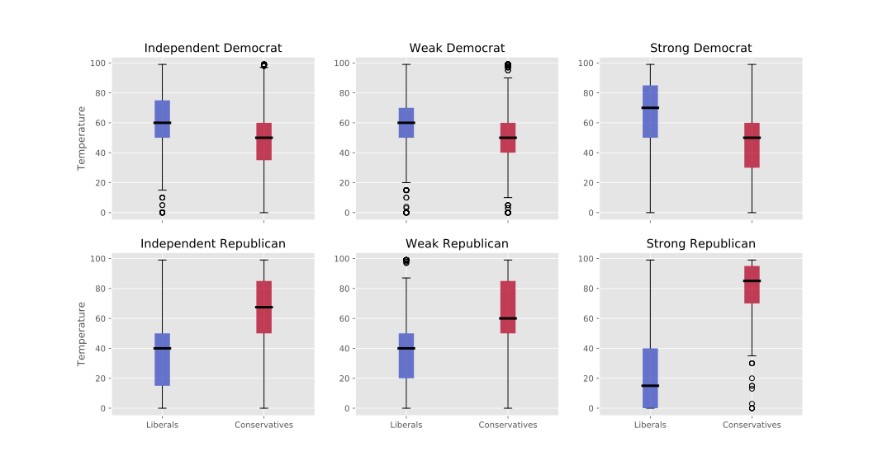
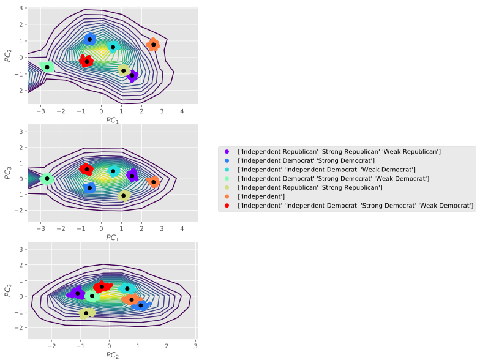

# Proposed Project

For my data incubator project, I propose building an app that tracks current public opinions to evaluate political identity extending beyond the standard left or right, blue or red metric.  By increasing the dimensionality of the political spectrum, voter trends become more targeted, discovering nuanced communities, and accurately addressing which issues are of concerns to voters.

As evident from the US 2016 elections, there has been an increasing partisan divide not only between Republican and Democratic parties, but from members within the parties themselves. As this divide increases, the residual impact is largely not understood within the scope of a two-party system.

The purpose of the app would be two-fold. First, users would be able to track their own political identity and comparatively evaluate their respective Congress and Senate representatives. The app would provide voters information with how a politician's voting records align with the user, and extends outside of party lines. Secondly, by providing users with a quiz or survey to track their political identity, public opinion can be gathered in real time, and questions can be directed to improve the political identity model. Doing so helps to better understand issues limited by a two-party system description.

# Generating Political Identity from Public Opinion

To build the model I would gather data from web APIs, such as govTrack, Gallup, and the Pew Research Center to create a dataset that organizes the political spectrum by relevant issues. In particular, using PCA methods to extract new axes within public opinion data. Combining this with clustering methods (such as k-means or hierarchical methods) allows for discovery of political subgroups. These subgroups would describe an individual's political leanings with respect to political issues (environmentalism, fiscal responsibility, etc) and thereby provide voter insights. This method would then generate a probabilistic model that describes how likely a series of political opinions overlaps with the current two-party system, and identify where separations exist.

# Exploratory Data Analysis of Political Identity

As an initial exploratory data analysis, I collected time-series (2012-2015) cumulative public opinion data from the [American National Election Studies][1]. From the survey, I collected and processed "feeling thermometer" questions to track current associations with parties and public opinion. Thermometer surveys have a respondent place their opinion of a topic on a scale from 0 to 100 degrees, where indifference or no opinion is 50, a unfavorable opinion less than 50, and a favorable opinion greater than 50. This allows a convenient metric to quantify public opinion.

For a more detailed discussion and the sample of code used for this analysis, please see the Jupyter Notebook `Analysis of Multi-Axial Political Identity.ipynb`.

As an example, in figure-1 I show the "Temperature" (or perception) of the words "Liberals" versus "Conservatives" in self described (independent, weak, and strong) Democrats and Republicans. The figures show that the alignment towards liberalism or conservatism does not necessarily follow a direct relationship with party lines. While increasing identification to Republicans is associated with a strong separation in temperature between terms Liberal and Conservative, the relation in Democrats is largely constant across all magnitudes. Additionally, the large variance in all subsets being indicative that the dimensionality of the data is overly reduced.

This overlap between the standard party lines, is indicative that other, or different, axes may better represent the political identity of the public. To evaluate what these new axes are on the political spectrum, perform Principal Component Analysis (PCA) to find the axes that capture the largest variance in the thermometer data, such that the number of dimensions used contain 95% of the explained variance. As the data is somewhat noisy, we first generate a **Gaussian Mixture Model** (GMM) to estimate, using an Expectation-Maximization algorithm, the 100 most probable locations along the underlying distribution. From these GMM means k-means is used to extract political groups within the data. If we assume that the standard two-party system (using the 7 categories described previously), then the k-means method should roughly identify these features as distinct groups within the data. By randomly sampling positions about the k-means centroids, as shown in the figure-2, we find that party associated with the centroids are largely overlapping with respect to **Independent**. In other words, the terms Democrat or Republicans (even of varying magnitude) can not sufficiently separate political identity as well as the new axes defined.

[1]: http://www.electionstudies.org/studypages/download/datacenter_all_NoData.php
